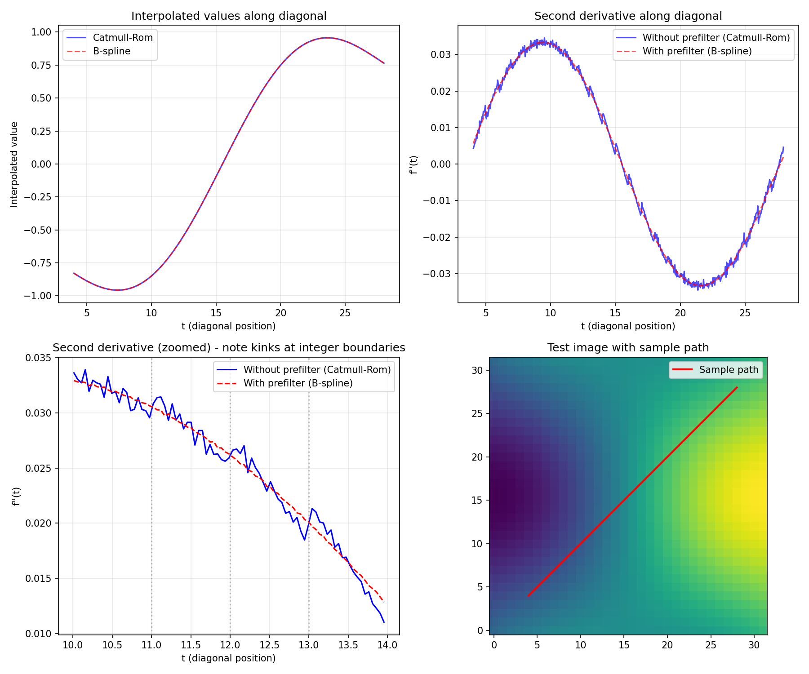
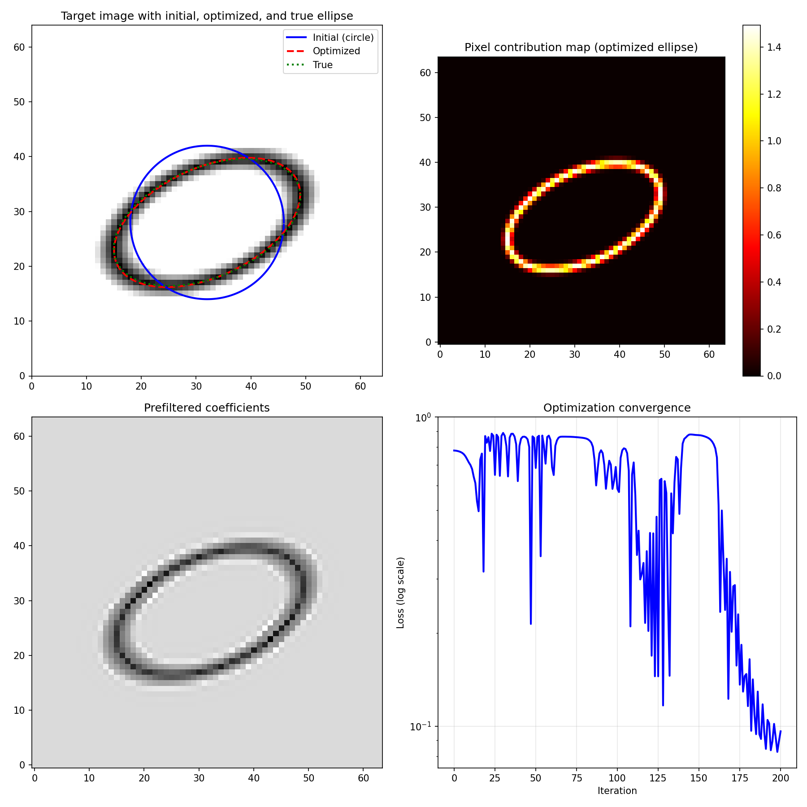
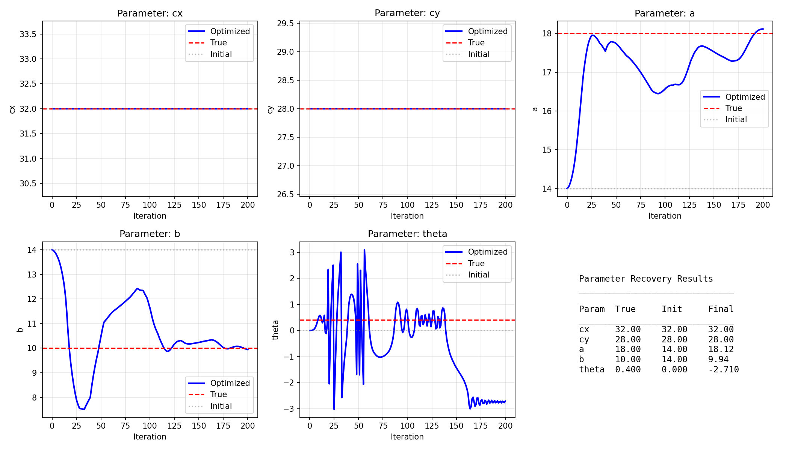

# jax-bicubic

C2-continuous bicubic interpolation with B-spline prefiltering for JAX.

## Motivation: Why C2 Continuity Matters for Gradient-Based Optimization

When optimizing parameters that control where we sample an image (e.g., curve fitting, camera calibration, registration), we need gradients of the sampled values with respect to the sampling coordinates. The smoothness of these gradients directly affects optimization quality.

Consider sampling an image I at coordinates (x, y) that depend on parameters θ:

```
loss(θ) = Σ I(x(θ), y(θ))
```

The gradient is:

```
∂loss/∂θ = Σ [ ∂I/∂x · ∂x/∂θ + ∂I/∂y · ∂y/∂θ ]
```

The terms ∂x/∂θ and ∂y/∂θ come from our parameterization (e.g., distortion model) and are typically smooth. But ∂I/∂x and ∂I/∂y come from the image interpolant, and their smoothness depends on our interpolation choice:

| Interpolation Method | Continuity | Gradient Behavior |
|---------------------|------------|-------------------|
| Nearest neighbor | C-1 (jumps) | Undefined/zero almost everywhere |
| Bilinear | C0 | Gradients exist but have jumps |
| Catmull-Rom bicubic | C1 | Gradients continuous, but 2nd deriv jumps |
| B-spline bicubic | C2 | Gradients smooth, 2nd derivs continuous |

### Why does C2 matter when we only need first derivatives?

1. **Second-Order Optimizers (L-BFGS, Newton)**: These methods estimate or use the Hessian. If ∂I/∂x has discontinuities in its derivative (C1 but not C2), the Hessian of the loss has discontinuities, causing erratic step sizes and poor convergence near pixel boundaries.

2. **Gradient Smoothness**: Even for first-order methods (SGD, Adam), smoother gradients mean the loss landscape is "nicer"—fewer sharp ridges and valleys that cause oscillation or slow convergence.

3. **Line Integrals**: When integrating along curves, the integrand's smoothness determines how accurately numerical quadrature approximates the true integral. C2 integrands converge faster with fewer sample points.

## Installation

```bash
pip install jax-bicubic
```

Or install from source:

```bash
git clone https://github.com/dstoutamire/jax_bicubic.git
cd jax_bicubic
pip install -e ".[test]"
```

## Quick Start

```python
import jax.numpy as jnp
from jax_bicubic import prefilter_2d, bicubic_sample

# Create or load an image
image = jnp.array(...)  # [H, W] float32 array

# Prefilter for C2 interpolation (do this once)
coeffs = prefilter_2d(image)

# Sample at arbitrary subpixel coordinates
coords = jnp.array([[10.5, 20.3], [30.7, 40.1]])  # [N, 2] array of (x, y)
result = bicubic_sample(coeffs, coords)
print(result.values)  # [N] array of interpolated values
```

## The B-Spline Prefiltering Approach

The challenge: We want C2 interpolation that passes through the original pixel values (interpolating property). The cubic B-spline basis is C2, but naive B-spline interpolation doesn't pass through the data points—it smooths them.

The solution: Prefilter the image to compute B-spline coefficients c[i,j] such that when we evaluate the B-spline at integer coordinates, we recover the original pixel values:

```
Σ c[i,j] · β(x-i) · β(y-j) = image[x,y]  for integer x,y
```

where β(t) is the cubic B-spline basis function.

This prefiltering is an IIR (infinite impulse response) filter with a single pole at z₀ = -2 + √3 ≈ -0.268. The filter is:
- Separable (apply 1D filter along rows, then columns)
- Two-pass (causal + anticausal for symmetry)
- O(H×W) total cost, ~8 ops per pixel
- Effectively local: influence decays as |z₀|^n ≈ 0.27^n, negligible after ~12 pixels

After prefiltering, evaluation uses the same 4×4 neighborhood as other bicubic methods, so per-sample cost is identical.

## Comparison with Catmull-Rom (Keys) Bicubic

Catmull-Rom is the most common "bicubic" interpolation (used by PIL, OpenCV, PyTorch's grid_sample, etc.). It requires no prefiltering and is interpolating, but is only C1 continuous.

| Property | Catmull-Rom | B-spline + Prefilter |
|----------|-------------|---------------------|
| Continuity | C1 | C2 |
| Precomputation | None | O(H×W) once |
| Per-sample cost | 16 mults + 12 adds | Same |
| Interpolating | Yes | Yes |
| Support | 4×4 pixels | 4×4 pixels (after prefilter) |

For one-shot sampling, Catmull-Rom is simpler. For iterative optimization, B-spline prefiltering is worth the upfront cost.

## Test Results

### C2 Continuity Test

This test compares the second derivatives of interpolated values along a diagonal path through a test image. The B-spline interpolant (red dashed) shows much smoother second derivatives than Catmull-Rom (blue solid), with significantly smaller jumps at pixel boundaries.



### Ellipse Optimization Demo

This demonstration shows gradient-based recovery of ellipse parameters. Starting from a circular initial guess (blue), the optimizer uses gradients flowing through the bicubic interpolant to find the true ellipse (green). The final optimized ellipse (red dashed) closely matches the ground truth.



### Parameter Convergence

The parameter evolution plots show how each ellipse parameter (center position, semi-axes, rotation angle) converges from the initial guess toward the true values during optimization.



## API Reference

### Prefiltering

```python
from jax_bicubic import prefilter_2d

coeffs = prefilter_2d(image)  # [H, W] -> [H, W]
```

Converts pixel values to B-spline coefficients. This is a one-time cost of O(H×W).

### Sampling

```python
from jax_bicubic import bicubic_sample, bspline_cubic_kernel, catmull_rom_kernel

# With prefiltered coefficients (C2 continuous)
result = bicubic_sample(coeffs, coords, kernel_fn=bspline_cubic_kernel)

# With raw image (C1 continuous, no prefiltering needed)
result = bicubic_sample(image, coords, kernel_fn=catmull_rom_kernel)

# Get pixel contribution map for visualization
result = bicubic_sample(coeffs, coords, compute_contributions=True)
print(result.contribution_map)  # [H, W] showing which pixels contributed
```

### Ellipse Utilities

```python
from jax_bicubic import ellipse_points, draw_ellipse

# Generate points along an ellipse (uniformly spaced by arc length)
coords = ellipse_points(cx, cy, a, b, theta, n_points=100)

# Draw an antialiased ellipse
image = draw_ellipse(shape, cx, cy, a, b, theta, line_width=1.5)
```

## Running Tests

```bash
# Install test dependencies
pip install -e ".[test]"

# Run all tests
python -m pytest tests/ -v

# Run specific test
python -m pytest tests/test_c2_continuity.py -v
```

## License

MIT License - see [LICENSE](LICENSE) for details.
